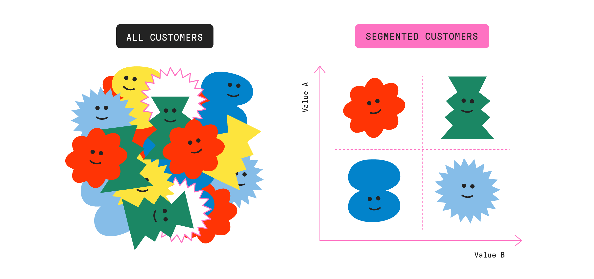
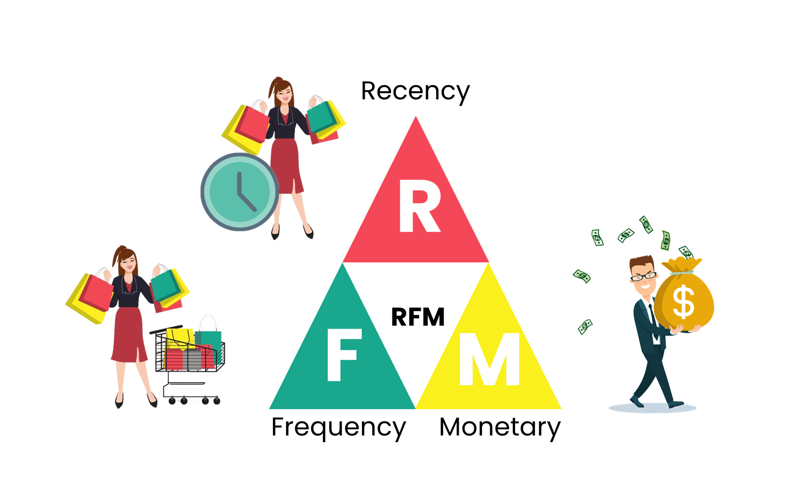

# Streamlit app:
link: https://andao711-segmentation-streamlit-rfm-final-dm5jtr.streamlit.app/
# Introduce

An e-commerce company wants to segment its customers and determine marketing strategies according to these segments. For example, it is desirable to organize different campaigns to retain customers who are very profitable for the company, and different campaigns for new customers.

Customer segmentation is the process of dividing customers into groups based on common characteristics so companies can market to each group effectively and appropriately. 

RFM analysis is a technique used to categorize customers according to their purchasing behaviour. RFM stands for the three dimensions:
- Recency: This is the date when the customer made the last purchase. It is calculated by subtracting the customer's last shopping date from the analysis date.
- Frequency: This is the total number of purchases of the customer. In a different way, it gives the frequency of purchases made by the customer.
- Monetary: It is the total monetary value spent by the customer.

#### Our Task:
Problem/ Requirement: Use RFM & Machine Learning algorithms in Python for Customers segmentation.

In this project, I have applied RFM & KMeans algorithms (with PCA) to cluster customers from file dataset CDNOW_master.txt (http://brucehardie.com/notes/026/).

*(I run some models: Kmeans, Kmeans with PCA, Hierarchical, Hierarchical with PCA, RFM manual (base on my domain knowledge) AND Kmeans with PCA is the best model in my case.)*
